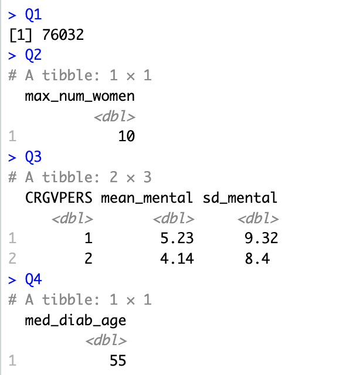
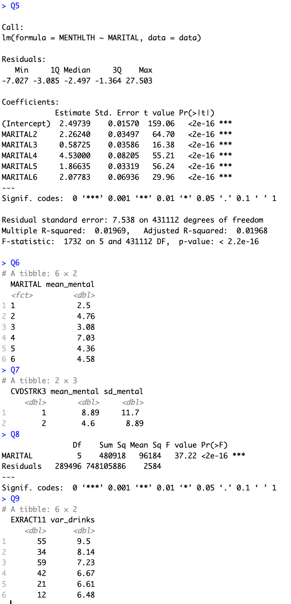

# R exams

Time: 20230420 (3 days)

Requirement: Visualization with ggplot, More R Exam, Model-Building, Correlation Exam, Linear Regression Exam, Logistic Regression Exam and 1 final project

  

  

